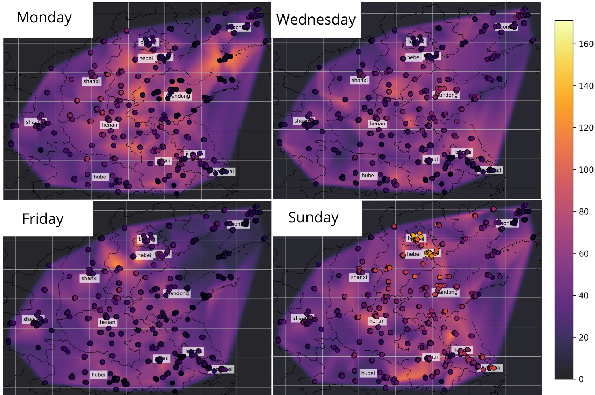
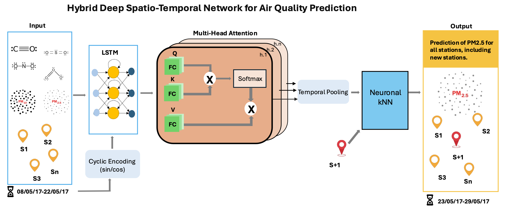

# AQ-Net: Deep Spatio-Temporal Neural Network for Air Quality Reanalysis

**Author:** Ammar Kheder  
**Affiliations:**  
- Lappeenranta–Lahti University of Technology (LUT)  
- Atmospheric Modelling Centre Lahti, Lahti University Campus  
- University of Helsinki  
- Chinese Academy of Sciences

---

## Overview

AQ-Net is a deep learning-based model designed for air quality reanalysis in both spatial and temporal domains. The model leverages an LSTM combined with multi-head attention to capture temporal dependencies, while a neural kNN module provides spatial interpolation for unobserved monitoring stations. An innovative cyclic encoding (CE) technique is also introduced to ensure continuous time representation, overcoming issues with discrete time boundaries.

The project focuses on PM2.5 analysis using data collected in northern China between 2013 and 2017. Extensive experiments have demonstrated that AQ-Net is robust in capturing both short-term (6-24 hours) and long-term (up to 7 days) pollutant trends, making it a valuable tool for environmental reanalysis, public health alerts, and policy decisions.



---

## Key Features

- **Hybrid Model Architecture:**  
  - **LSTM-Multi-Head Attention:** Captures long-term temporal dependencies and selectively weights critical time steps.
  - **Cyclic Encoding (CE):** Projects time-related features into a continuous 2D sinusoid space to avoid discontinuities.
  - **Neural kNN Interpolation:** Fills spatial gaps by interpolating features from observed stations to unobserved ones.
    


- **Robust Reanalysis:**  
  Designed to reconstruct historical air pollution levels even in regions with sparse sensor coverage, ensuring both spatial and temporal consistency.

- **Comprehensive Evaluation:**  
  The model has been quantitatively and qualitatively evaluated against traditional methods (e.g., LSTM, linear regression, and PatchTST), showing improved performance in terms of MAE, RMSE, and R² scores.

---

## Project Structure
AQ-Net/                         <– Root directory
├── LICENSE                     <– MIT License file
├── README.md                   <– This file
├── requirements.txt            <– Python package dependencies
├── main.py                     <– Main script to run the entire pipeline
├── data/                       <– Data directory (include CSV files here)
│   └── sorted_air_quality_data_with_regions.csv
└── src/                        <– Source code directory
├── init.py             <– Package initialization
├── data_preprocessing.py   <– Data loading and preprocessing functions
├── dataset.py              <– PyTorch Dataset definition
├── model.py                <– Model definition (LSTM + Attention)
├── training.py             <– Training and evaluation functions
└── knn_interpolation.py    <– KNN interpolation and post-processing functions

---

## Installation

1. **Clone the repository:**

   ```bash
   git clone https://github.com/AmmarKheder/AQ-Net.git
   cd AQ-Net
2. **Install dependencies:**
   pip install -r requirements.txt

3. **Usage**
Run the main script to execute the entire pipeline:
  python main.py
This will:
	1.	Load and preprocess the data (filtering, normalization, etc.).
	2.	Split the dataset into training, validation, and test sets.
	3.	Create PyTorch datasets and data loaders.
	4.	Define and train the AQ-Net model (LSTM + Attention + neural kNN).
	5.	Evaluate the model (MAE, RMSE, R²).
	6.	Visualize spatial predictions for unobserved stations.


